# Konado: Visual Novel Framework

English | [简体中文](README.zh-CN.md) | [繁體中文](README.zh-TW.md) | [日本語](README.ja.md) | [한국어](README.ko.md)

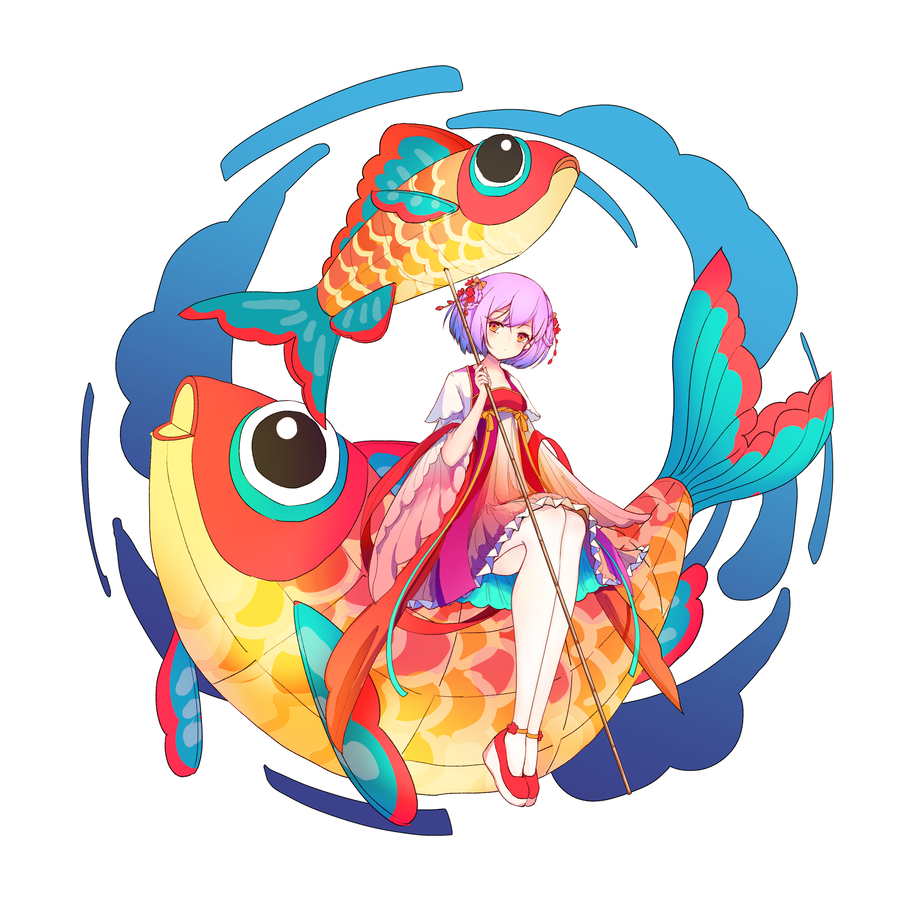

 

  
  
  
  
  
  
  
  

 

## Overview

Konado is a dialogue creation toolkit for the Godot Engine, with templates and a dialogue manager to help you quickly build Visual Novels, Gal Games, RPGs and other story‑driven projects.

## Quick Start

Get up and running with Konado in minutes by following our [Quick Start Guide](https://godothub.com/oss/konado/en/2.4/tutorial/install.html).

## Documentation

For comprehensive guides, API references, and advanced tutorials, visit our official project website: https://godothub.com/oss/konado/en/2.4/.

## Community

Join our community to connect with other Konado users, share ideas, and get support. You can participate through:

- QQ Channel Discussion Group: [Join Now](https://pd.qq.com/g/godot)
- Discord Server Channel: [Join Now](https://discord.com/channels/1378639076747513938/1425084240550166592)

<a href="https://godothub.com">
<picture>
  <source media="(prefers-color-scheme: dark)" srcset="https://legacy.godothub.com/godothub_dark_logo.png">
  <source media="(prefers-color-scheme: light)" srcset="https://legacy.godothub.com/godothub_light_logo.png">
  
</picture>
</a>

## Sponsors

If you appreciate our work, please consider supporting us via this [link](https://afdian.com/item/52230b2860a011f083ef52540025c377). Your sponsorship helps us keep improving Konado and providing better support to the community.

  

## Contributing

Interested in contributing to Konado? Check out our [CONTRIBUTING.md](./CONTRIBUTING.md) for detailed guidelines on how to get involved.

## Code of Conduct

This project adheres to our [Code of Conduct](./CODE_OF_CONDUCT.md). By participating, you are expected to uphold this code.

## Konado Project Team

- [DSOE1024](https://github.com/DSOE1024)
- [putyk](https://github.com/putyk)
- [moluopro](https://github.com/moluopro)
- [ioniccrystal](https://github.com/ioniccrystal)
- [fangchu](https://github.com/fangchudark)

## Contributors

The following people contributed to this project:

<a href="https://github.com/godothub/konado/graphs/contributors" target="_blank">
  <picture>
	<source media="(prefers-color-scheme: dark)" srcset="https://contrib.rocks/image?repo=godothub/konado&theme=dark" />
	<source media="(prefers-color-scheme: light)" srcset="https://contrib.rocks/image?repo=godothub/konado" />
	
  </picture>
</a>

<!-- BEGIN MADE BY KONADO -->
## Made by Konado

> A showcase of Konado works from [GodotHub](https://godothub.com/game/visual-novel).

<a href="https://godothub.com/asset/m07csjky18z5o6v"><picture><source media="(max-width: 767px) and (prefers-color-scheme: dark)" srcset="./assets/made-by-konado/en/dark/m07csjky18z5o6v.svg" width="1200"><source media="(max-width: 767px)" srcset="./assets/made-by-konado/en/light/m07csjky18z5o6v.svg" width="1200"><source media="(prefers-color-scheme: dark)" srcset="./assets/made-by-konado/en/dark/m07csjky18z5o6v.svg">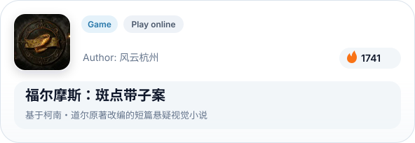</picture></a>&emsp;<a href="https://godothub.com/asset/91gnqrsmv683edj"><picture><source media="(max-width: 767px) and (prefers-color-scheme: dark)" srcset="./assets/made-by-konado/en/dark/91gnqrsmv683edj.svg" width="1200"><source media="(max-width: 767px)" srcset="./assets/made-by-konado/en/light/91gnqrsmv683edj.svg" width="1200"><source media="(prefers-color-scheme: dark)" srcset="./assets/made-by-konado/en/dark/91gnqrsmv683edj.svg">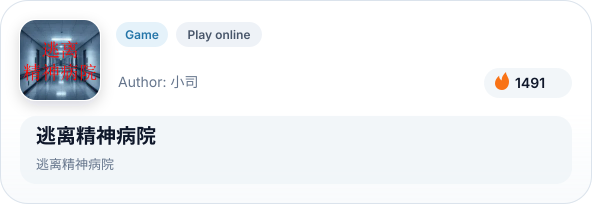</picture></a>

<a href="https://godothub.com/asset/lz94hqgxiqm6i38"><picture><source media="(max-width: 767px) and (prefers-color-scheme: dark)" srcset="./assets/made-by-konado/en/dark/lz94hqgxiqm6i38.svg" width="1200"><source media="(max-width: 767px)" srcset="./assets/made-by-konado/en/light/lz94hqgxiqm6i38.svg" width="1200"><source media="(prefers-color-scheme: dark)" srcset="./assets/made-by-konado/en/dark/lz94hqgxiqm6i38.svg">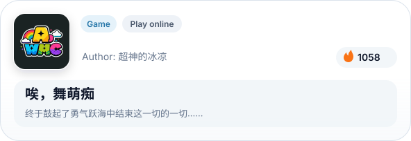</picture></a>&emsp;<a href="https://godothub.com/asset/7jpmwjsd7t74mtk"><picture><source media="(max-width: 767px) and (prefers-color-scheme: dark)" srcset="./assets/made-by-konado/en/dark/7jpmwjsd7t74mtk.svg" width="1200"><source media="(max-width: 767px)" srcset="./assets/made-by-konado/en/light/7jpmwjsd7t74mtk.svg" width="1200"><source media="(prefers-color-scheme: dark)" srcset="./assets/made-by-konado/en/dark/7jpmwjsd7t74mtk.svg">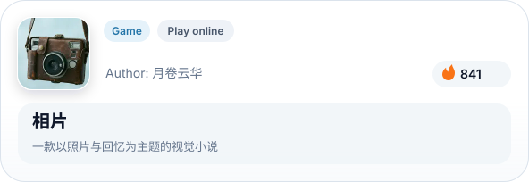</picture></a>

<a href="https://godothub.com/asset/wnktmumcg6cvitt"><picture><source media="(max-width: 767px) and (prefers-color-scheme: dark)" srcset="./assets/made-by-konado/en/dark/wnktmumcg6cvitt.svg" width="1200"><source media="(max-width: 767px)" srcset="./assets/made-by-konado/en/light/wnktmumcg6cvitt.svg" width="1200"><source media="(prefers-color-scheme: dark)" srcset="./assets/made-by-konado/en/dark/wnktmumcg6cvitt.svg">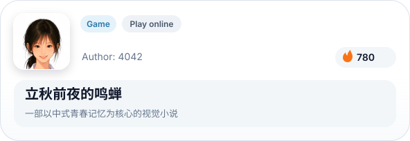</picture></a>&emsp;<a href="https://godothub.com/asset/wrz7qs36ntsnxqo"><picture><source media="(max-width: 767px) and (prefers-color-scheme: dark)" srcset="./assets/made-by-konado/en/dark/wrz7qs36ntsnxqo.svg" width="1200"><source media="(max-width: 767px)" srcset="./assets/made-by-konado/en/light/wrz7qs36ntsnxqo.svg" width="1200"><source media="(prefers-color-scheme: dark)" srcset="./assets/made-by-konado/en/dark/wrz7qs36ntsnxqo.svg">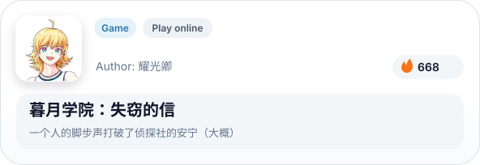</picture></a>

<a href="https://godothub.com/asset/i5ao33yuq8tr9rz"><picture><source media="(max-width: 767px) and (prefers-color-scheme: dark)" srcset="./assets/made-by-konado/en/dark/i5ao33yuq8tr9rz.svg" width="1200"><source media="(max-width: 767px)" srcset="./assets/made-by-konado/en/light/i5ao33yuq8tr9rz.svg" width="1200"><source media="(prefers-color-scheme: dark)" srcset="./assets/made-by-konado/en/dark/i5ao33yuq8tr9rz.svg">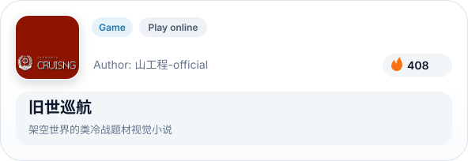</picture></a>&emsp;<a href="https://godothub.com/asset/8xibg3dzqcui7py"><picture><source media="(max-width: 767px) and (prefers-color-scheme: dark)" srcset="./assets/made-by-konado/en/dark/8xibg3dzqcui7py.svg" width="1200"><source media="(max-width: 767px)" srcset="./assets/made-by-konado/en/light/8xibg3dzqcui7py.svg" width="1200"><source media="(prefers-color-scheme: dark)" srcset="./assets/made-by-konado/en/dark/8xibg3dzqcui7py.svg">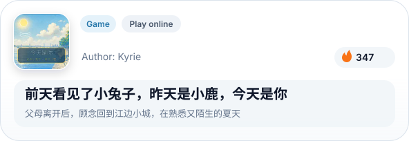</picture></a>

<a href="https://godothub.com/asset/gm1tvpxth4v41ql"><picture><source media="(max-width: 767px) and (prefers-color-scheme: dark)" srcset="./assets/made-by-konado/en/dark/gm1tvpxth4v41ql.svg" width="1200"><source media="(max-width: 767px)" srcset="./assets/made-by-konado/en/light/gm1tvpxth4v41ql.svg" width="1200"><source media="(prefers-color-scheme: dark)" srcset="./assets/made-by-konado/en/dark/gm1tvpxth4v41ql.svg">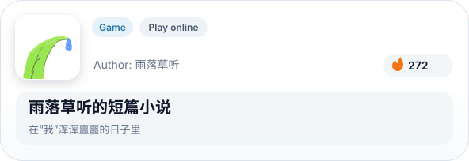</picture></a>&emsp;<a href="https://godothub.com/asset/lva4zsfmzcflpjv"><picture><source media="(max-width: 767px) and (prefers-color-scheme: dark)" srcset="./assets/made-by-konado/en/dark/lva4zsfmzcflpjv.svg" width="1200"><source media="(max-width: 767px)" srcset="./assets/made-by-konado/en/light/lva4zsfmzcflpjv.svg" width="1200"><source media="(prefers-color-scheme: dark)" srcset="./assets/made-by-konado/en/dark/lva4zsfmzcflpjv.svg">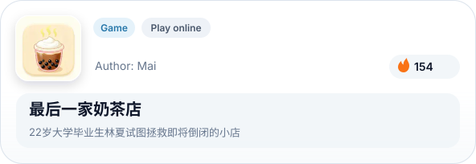</picture></a>

<!-- END MADE BY KONADO -->

## Open Source License

Konado is released under a multi-license model, allowing you to choose the most suitable license for your needs:

- **MIT License**: [LICENSE-MIT](./LICENSE) — The most permissive license, suitable for commercial integration and rapid development, with minimal restrictions
- **BSD 3-Clause License**: [LICENSE-BSD](./LICENSE-BSD) — Prohibits using the original author's name for product endorsement, suitable for enterprise scenarios requiring brand isolation
- **Mulan PSL v2 License**: [LICENSE-MULANPSL](./LICENSE-MULANPSL) — A domestic open source license that includes patent licensing terms, provided by the OpenAtom Foundation, suitable for domestic requirements